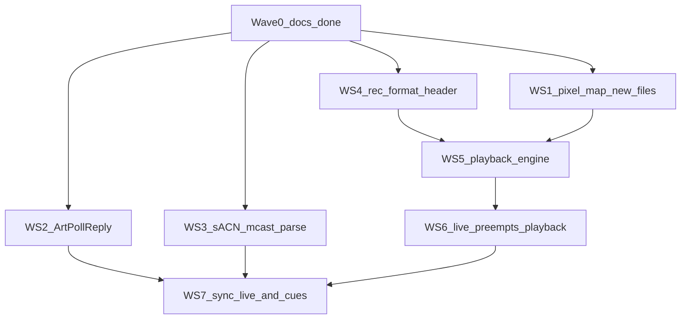

# DMX_whIP_embedded

Version: **0.32.0**

The embedded side of DMX_whIP: firmware for pixel nodes that will receive live Art-Net / sACN (KiNet later) and play recorded frames from SD. This tree is shared across boards. Current hardware is a **Waveshare ESP32-S3-Matrix** bring-up node plus an **ESP32-C5-DevKitC-1-N8R4** env, not the production controller.

The 18-month-old [`Esp32-s3 Pixel Playback — Rebuild Plan (step-by-step).pdf`](Esp32-s3%20Pixel%20Playback%20%E2%80%94%20Rebuild%20Plan%20(step-by-step).pdf) is **historical**. New boards follow **Adding a board** below. Never copy the PDF’s `platformio.ini` (`qspi_opi`, 8MB-class flash, SDMMC, huge rings, AsyncWebServer + LittleFS SPA) and never use official `platform = espressif32` for a new chip.

Local `ARCHIVE/` is gitignored. It is the old generic ESP32-S3 controller (GPIO 15, 256 LEDs, SPIFFS SPA, AsyncWebServer). **Do not port it onto `[env:matrix]`**. Harvest ideas only: pixel-map fields, a `DMXProtocol`-style adapter, ArtPoll, sACN multicast `239.255.(uni>>8).(uni&0xFF)`, and archive `DMXREC` as a v0 file layout to replace.

## Current hardware (`[env:matrix]`)

- MCU: ESP32-S3FH4R2 — **4MB flash, 2MB QSPI PSRAM** (`qio_qspi`, `default.csv`)
- LED: 8×8 WS2812B on GPIO 14, GRB, default brightness **10/255** (Patch tab 0–255; warn above 128 — this panel can overheat). Patch is a list of outputs and same-GPIO chain segments (NVS `pmap` blob + segment-0 mirror). Matrix caps: 8 outputs, 24 segments, 1024 total pixels, 16 live universe slots. `POST /map`, idle.
- USB-C: native USB-Serial/JTAG (`ARDUINO_USB_CDC_ON_BOOT=1`, `ARDUINO_USB_MODE=1`)
- microSD: **SPI** CS 7, MOSI 6, CLK 5, MISO 4 (3.3 V module only)

Prove the **pipeline** here with 64 pixels. Retarget with **Adding a board**. Share `src/`; do not fork the tree. One node is not 100k live pixels.

## Current hardware (`[env:c5]`)

- MCU: ESP32-C5 — **8MB flash, 4MB QSPI PSRAM** (pioarduino `esp32-c5-devkitc1-n8r4`, `default_8MB.csv`)
- LED: 5×5 WS2812B on GPIO **24**, GRB, default brightness **10/255** (no overheat banner; Patch count hint is 25)
- USB: UART bridge for `Serial` (no `ARDUINO_USB_CDC_ON_BOOT`). Native USB-JTAG GPIO 13/14 is reserved.
- microSD: **SPI** CS 10, MOSI 7, CLK 6, MISO 2 (3.3 V module only)
- Caps: 2 outputs (C5 has 2 RMT TX channels), 24 segments, 1024 total pixels, 16 live universe slots. Reserved: USB 13/14, flash/PSRAM 15–22. Dual-band Wi-Fi: Setup Band default 2.4 GHz (Auto / 5 GHz optional).

## Adding a board

This section is the starter. Platform is pinned **pioarduino** in the common `[esp32]` section of [`platformio.ini`](platformio.ini) (Arduino 3.3.x / IDF 5.5.x). Official PlatformIO `espressif32` does not support C5 / C6 / P4.

1. Share `src/`. Add `[env:…]` that `extends = esp32`.
2. Add `include/boards/<id>.h` (or keep a `board_*.h` next to [`include/board_matrix.h`](include/board_matrix.h)) and a `-DBOARD_PROFILE_<ID>` flag. [`include/boards/select.h`](include/boards/select.h) includes that header or `#error`.
3. The profile owns: `id` / `chip` / `flashClass`, GPIO max, reserved pins (USB, flash, PSRAM, later ETH), default LED/SD (or SDMMC later), `BoardRadio` (`wifi` / `eth` / `hosted`), `kCpuCount`, `kServiceCore`. Flash / PSRAM / USB CDC stay compile-time flags on the env.
4. Pins the user can change stay NVS overlays (`POST /pins`, `POST /map`). Do not compile one firmware per Amazon SKU.
5. Companion `firmware/catalog.json` must match `id` / `chip` / defaults when that env is flashed from the app. One firmware **artifact** (chip + flash + PSRAM + USB class) can back many SKUs via pin overlays.

### Bring-up set (inventory)

- Waveshare ESP32-S3-Matrix — `[env:matrix]` (default)
- ESP32-C5-DevKitC-1-N8R4 — `[env:c5]`
- Next: ESP32-C6-DevKitC-1-N8 (8MB flash, no PSRAM)
- Seeed XIAO ESP32-C5 (dual-band, tiny pinout; likely no onboard SD)
- ESP32-P4-POE-ETH — Waveshare P4 PoE ETH family until the exact SKU is confirmed. [ESP32-P4-WIFI6-POE-ETH](https://www.waveshare.com/wiki/ESP32-P4-WIFI6-POE-ETH) is P4 + onboard C6-MINI-1 (SDIO ESP-Hosted) + IP101 10/100 + PoE header. First P4 bring-up is **Ethernet-only**; hosted Wi-Fi is later.

### Wide catalog and Custom (companion, later)

Do not compile one image per listing. Two layers:

- **Presets:** harvest [pioarduino `boards/*.json`](https://github.com/pioarduino/platform-espressif32) (chip, flash, PSRAM, USB, vendor).
- **Artifact:** the binary we build (`esp32s3-4mb-qspi`, later `esp32c6-8mb`, `esp32c5-8mb-psram`, `esp32p4-…`).
- **Custom…** on the Flash page: user picks core, flash, PSRAM, USB CDC, LED/SD/ETH pins, saves a catalog row (local, optionally upstream). Same shape as a preset.

### P4 + C6 / C5 / S3 combo (later)

ESP-Hosted / `esp_wifi_remote` over SDIO or SPI. If the PoE ETH board is WIFI6-POE-ETH, the C6 is already onboard. Do not start this until Ethernet-only P4 works.

## Flash and serial

Matrix upload: hold **BOOT**, tap **RESET**, release **BOOT**, then `pio run -e matrix -t upload`. Serial window: `ESP32 COM3` via [`scripts/serial-monitor.ps1`](scripts/serial-monitor.ps1). Details are in [`.cursor/rules/esp32-matrix.mdc`](.cursor/rules/esp32-matrix.mdc). C5 uses `pio run -e c5 -t upload` on its own COM port (UART USB); do not use the Matrix COM3 handshake.

## SoftAP config portal

- SSID `dmxwhip`, password `pass1234`, page `http://4.3.2.1` (Live / Playback / Patch / Setup)
- Click the bold title to rename (Enter or blur saves; Escape cancels). **Identify** sits under the name (idle only). Lands on **Live** when STA has an IP, otherwise **Setup**. The `live` / `play` / `idle` pill is the first block on Live.
- AP+STA: scan, connect, always **remember** last STA network in NVS and reconnect at boot. Dual-band chips (C5) have Setup **Band** Auto / 2.4 GHz / 5 GHz (NVS `band`, default **2.4 GHz**). SoftAP is always started on 2.4 GHz. 5 GHz / Auto keep the radio on dual-band **AUTO** (never 5 GHz-only) and join a saved BSSID so SoftAP cannot brick. Setup fills the saved SSID and hidden password (eye to reveal); changing Band does not rewrite those fields. Band filters the scan list (Auto merges the same SSID onto one `2.4 + 5 GHz` row). The connected network is highlighted. **Save** writes Band / FPS / buffer / park and applies radio mode for the next scan; it does not reconnect STA. **Connect** persists creds and joins a BSSID on the selected Band (Auto prefers 5 GHz when both twins exist; 5 GHz does not fall back to 2.4). **Forget saved network** clears SSID/password/BSSID (not band) and drops STA. HTTP stays up on whichever interface has an IP (SoftAP `4.3.2.1` and/or STA). **Hide AP if connected** (Setup, NVS `park`, default **Yes**): Yes + STA → SoftAP and captive DNS stop so the radio is STA-only; HTTP stays on the STA IP. **No** leaves SoftAP up alongside STA so a phone can still join `dmxwhip`. SoftAP returns if STA drops or never connects. The page **scans the first time Setup is opened**; **Scan** starts a fresh scan using the Band dropdown (`/scan?start=1&band=`).
- Captive DNS hijacks all names to `4.3.2.1`. Probe URLs (`/generate_204`, `/hotspot-detect.html`, `/connecttest.txt`, …) return the portal HTML with **200**, never OS “success” tokens (no HTTP 204 for Android, no Apple `Success`, no Windows NCSI pass string).
- Limit: HTTPS connectivity checks cannot be spoofed. Some new phones only show a sign-in notification. DHCP Captive-Portal-API (RFC 8910) is possible on this IDF 5.5 core but is not implemented yet. If the sheet does not open, use `http://4.3.2.1` (not https).
- Connecting STA may hop the SoftAP channel; if the page drops, rejoin `dmxwhip`. With park **Yes** and STA up the AP is gone — unicast to the **STA IP** (serial `[V][wifi] connected ... ip=`). Park **No** keeps `dmxwhip` / `http://4.3.2.1` plus STA HTTP. With no STA, use `dmxwhip` / `http://4.3.2.1`. STA connect timeout starts when `loop()` runs so a slow SD mount cannot drop a saved network. Art-Net / sACN UDP rebind after park applies SoftAP policy so companion ArtPoll still sees a node that auto-plays SD at plug-in. Show-LAN polls advertise the STA IP, not `4.3.2.1`. Bind retries if the first listen fails. Wi-Fi power save is off while STA is connected.
- Per-segment brightness 0–255 on **Patch** (immediate `POST /brightness` with `i`). Applied once when packing pixels. Identify may temporarily use the FastLED boost. Node master `/status` `bri` is still `LedCtrl` (`POST /brightness` without `i`). Matrix warning on the page above 128; the value is not capped. C5 has no overheat banner.
- Live protocol is per Patch segment (Auto / Art-Net / sACN). Art-Net and sACN can run at once when different segments need them. `/status` `proto` is `auto` / `artnet` / `sacn` / `mixed`. `POST /live` `proto` still sets every segment (compat). Setup keeps **show FPS** 20 / 30 / 40 / 60 (`fps`), **buffer** 0 latest … 3 frames (`buf`), **Hide AP if connected** Yes / No (`park`, default Yes), and **Sync takeover** Yes / No (`takeover`, default Yes). `/live` accepts `park` while a stream is up. **Identify:** header button and `POST /identify` (form `ms`, default 3000, 200–15000) flashes cyan/white on all outputs while idle; it does not mark the node live. 503 while a stream owns the LEDs (not during playback hold). Locate scale is `max(saved bri, 64)` then restored.
- Live tab polls cheap `GET /api/stats` and shows a no-scroll 2×2 dashboard (radio with RSSI bars and 2.4 GHz / 5 GHz / Wired link, stream numbers, SD meter, now-playing) plus an identity/health strip. Playback and Patch stay editable while a stream is up. **Patch** is a collapsible list: **Add Output +** (right of Save) adds an output; parent **+** adds a same-GPIO chain segment (GPIO / IC / clock locked; list order is wire order). Child rows use up/down/trash icons (arrows hidden at the ends of a group). Each row has protocol, IC, data/clock GPIO, count, white/CCT, order, start universe/channel, and brightness. The collapsed line shows that fixture’s start–end universe.channel (e.g. `0.1–0.192`). The expanded editor packs two fields per line. **Save** posts indexed `/map` (`n`, `proto0`…) and applies the map in place (LED rebind + live sockets), including while a stream is up. Browsing the form does not rebind. Playback lists `.dmx` files and folders (`/status` `play`) as an indented tree with Ctrl/Shift multi-select, second-click title edit, and icon Prev / Play / Pause / Stop / Next / Delete. POSTs `/play` for the playlist (NVS). A live stream still preempts a file. Play, previous, or next while a stream owns the LEDs asks before sending `override=1`, which sets playback hold (`play.hold`) so the file wins. The Live page **Stream** button (`action=live`) clears hold. Stop clears it too. The hold also clears when the playlist has no next file. `src=stop` (or `action=stop`) parks playback without changing the saved playlist; `action=pause` / `action=resume` hold and continue the current file. Companion `POST /upload` (multipart `path` + `file`) streams a `.dmx` onto the card while idle, then `POST /meta` for the sidecar title. Pull the card → not mounted; reinsert → automount. `/status` object `sd` (`used_mb` / `free_mb` omitted until the walk finishes). Playback still fills output 0 from segment 0’s start uni/ch; other outputs stay black while idle.

## Art-Net / sACN (Resolume)

- Art-Net: UDP **6454**. Each Art-Net/`auto` segment has its own start universe (default **0**; Resolume “universe 1” is often Art-Net 0). sACN: UDP **5568**, per-segment start (sACN-native on an sACN row; otherwise Art-Net + 1), unicast to STA IP or multicast `239.255.(uni>>8).(uni&0xFF)`. Same data GPIO concatenates segments in list order (e.g. 64 px Art-Net 0.1 then 150 px sACN 8.1). Wire order is the row `order` (default GRB). White and/or CCT add channels and shrink pixels-per-universe.
- Live path: buf 0 = drop-to-latest; buf 1–3 = small jitter queue (drop oldest if full). Show rate from portal FPS. Idle plays companion `DMXREC` `.dmx` from SD onto **output 0** (consecutive universes from the first segment start uni/ch, packed to that output’s pixel count). Default: all `.dmx` directly in `/`, alphabetical, wrap forever. A selected file can loop itself or continue with its parent playlist; a selected folder plays nested `.dmx` by full path (repeat forever, or N times then black). No file = black. Serial `[V][artnet]` / `[V][sacn]` first packet + 5 s counters; `[V][ap] down (sta)` / `[V][ap] up`; `[V][play] file=` / `[V][play] list`.

## Living milestone list

Do not delete lines. `[ ]` not done. `[x]` implemented. `[x] **verified**` only after hardware confirmation.

Bring-up (this board)

- [x] **verified** — Serial logging (`Log` / `LOG_V` / `LOG_C`, RAM replay, `logsvc`)
- [x] **verified** — SoftAP `dmxwhip` + config page scan / connect
- [x] LED rainbow smoke test (GPIO 14, GRB, brightness 10) — implemented
- [x] SD SPI mount + root listing — implemented (not verified)
- [x] STA credentials persist in NVS and reconnect at boot — implemented
- [x] Captive probe handlers + viewport-fixed portal + Forget + version in `/status` — implemented (this rev; captive auto-open not verified)
- [x] SoftAP IP `4.3.2.1` (DHCP gateway + DNS) — implemented
- [x] SoftAP stops ~45 s after STA IP (STA-only for live); AP returns if STA drops — implemented (superseded: AP is down only while `LiveInput` is fresh; see next item)
- [x] Idle = black panel + SoftAP/HTTP; live protocol = pixels + portal down; AP returns after ~2 s silence — implemented (not verified)
- [x] Live Art-Net 1:1 channel → LED index (no firmware snake remap) — implemented (not verified)
- [x] Portal max brightness 0–255 (default 10, NVS, warn >64) — implemented (not verified)
- [x] SD mount/size/used/free on portal `/status` — implemented (not verified)
- [x] Portal brightness number + slider; scan on load; SD hotplug unmount/automount — implemented (not verified)
- [x] Portal live protocol / FPS / buffer + sACN E1.31 — implemented (not verified)
- [x] Portal Network / Playback tabs; Playback lists SD `.dmx` / folders and sets the idle playlist — implemented (not verified)
- [x] SD playlist: root `.dmx` alphabetical wrap; file loop one/all; folder recursive forever or N then black — implemented (not verified)
- [x] Portal `POST /identify` locate flash (idle; no LiveInput; 503 if live) — implemented (not verified)
- [x] Companion `POST /upload` stream `.dmx` to SD + `POST /play` `src=stop` — implemented (not verified)
- [x] Companion node name + SD rename / stream pull / order prefixes — implemented (not verified)
- [x] SoftAP faceplate (status strip, Playback / Setup, companion-equivalent transport and radio list) — implemented (not verified)
- [x] Portal Live / Playback / Pixels / Setup; click-to-edit name; Identify under title; `/api/stats` + `/status` `rssi` — implemented (not verified)
- [x] Portal Live radio link (2.4 GHz / 5 GHz / Wired) + Setup Band Auto/2.4/5 on 5 GHz chips (`wifi_5g` / `band` / `link`, `POST /band`) — implemented (not verified)
- [x] Setup scan filter + saved SSID/password + 5 GHz BSSID join (AUTO, never 5 GHz-only) — implemented (not verified)
- [x] Live status cards + Pixels editor (IC / order / count / GPIO / brightness); idle `POST /map` + NVS LED overlay — implemented (not verified)
- [x] Live tab no-scroll 2×2 dashboard (signal bars, SD meter, stream numbers, identity/health strip) — implemented (not verified)
- [x] Patch tab (was Pixels): IC catalog, clock pin, RGB/RGBW/CCT, start universe/channel, live protocol; queued LED rebind — implemented (not verified)
- [x] Patch Save button (no auto `/map` / proto while browsing the form) — implemented (not verified)
- [x] Patch multi-output list + same-GPIO chain segments; per-segment protocol/universe; dual Art-Net+sACN live — implemented (not verified)
- [x] Park portal while live Yes/No (NVS; default Yes) — implemented (not verified; superseded: `park` now hides SoftAP when STA is up; HTTP stays)
- [x] Hide AP if connected (`park` Yes/No) + HTTP always on STA; SD boot no longer drops STA/ArtPoll — implemented (not verified)
- [x] ArtPoll after STA + park while SD is already playing (rebind after SoftAP down; STA IP in replies) — implemented (not verified)
- [x] Portal live-lock banner above tabs; Patch Add Output + on the right; child up/down/trash icons — implemented (not verified)
- [x] Patch Save / `POST /map` reboots after persist so the new map is loaded — implemented (not verified; superseded: Save applies the map in place)
- [x] Playback and Patch stay editable while a stream is up; Patch Save applies without reboot — implemented (not verified)
- [x] Portal Playback tree (nested SD folders, Ctrl/Shift select, graphic transport with pause, second-click title, delete, sidecar titles on `/status` `play.titles`) — implemented (not verified)

Multi-board (queued — do not start unless asked)

- [x] **Adding a board** recipe used for the next env — implemented (`[env:c5]`; not verified)
- [ ] `[env:c6]` ESP32-C6-DevKitC-1-N8
- [x] `[env:c5]` ESP32-C5-DevKitC-1-N8R4 — implemented (25 px GPIO 24, SD 10/7/6/2; not verified)
- [ ] `[env:xiao-c5]` Seeed XIAO ESP32-C5
- [x] Dual-band STA scan/connect (C5 / XIAO C5); SoftAP stays 2.4 GHz — implemented (Band filter + BSSID join; not verified)
- [ ] `NetIf` so UDP/HTTP do not call `WiFi.*` directly
- [ ] `[env:p4-eth]` Ethernet DHCP + portal/ArtPoll on LAN IP (confirm exact P4 SKU)
- [x] Companion identify / flash not S3-only — implemented (catalog chip must match the port; Custom / harvest still queued)
- [ ] Companion: harvest pioarduino board presets; Flash **Custom…** (core + flash + PSRAM + USB + pins); map SKUs → artifact + NVS overlay; NVS offset not hardcoded to 0x9000
- [ ] P4 + C6/C5/S3 combo (ESP-Hosted / `esp_wifi_remote`, SDIO/SPI). Ethernet-only P4 first
- [ ] RFC 8910 captive portal (IDF 5 now; not implemented)

From the historical PDF (adapted)

- [x] Board profile as data (pins, flash, PSRAM, LED count, ring sizes); extra PlatformIO envs without forking `src/` — implemented (Matrix + C5 profiles + NVS SD overlay; not verified)
- [x] pioarduino common `[esp32]` platform (55.03.39 / Arduino 3.3.9 / IDF 5.5.4); `[env:matrix]` still the default — implemented (`pio run -e matrix` succeeds; flash not verified)
- [x] Board profile selectable via `BOARD_PROFILE_*` + [`include/boards/select.h`](include/boards/select.h); GPIO max / reserved pins / radio / service core from the profile; `/status` `patch.gpio_max` — implemented (Matrix + C5; not verified)
- [x] Companion `/status` `api` plus `chip` / `board` / `pins` — implemented (not verified)
- [x] NVS SD pin overlay + idle `POST /pins` remount — implemented (not verified)
- [x] JSON `/api/stats` (Wi-Fi IP/RSSI, later queue depths / drops / FPS) — implemented (`rssi`, `queued`, `drops`, `pps`, `src`, `age_ms`, heap/PSRAM; not verified)
- [ ] RTOS layout: RX on APP CPU, render on PRO CPU, SD I/O task; rings allocated at boot
- [ ] Protocol adapter interface + DMX universe assembler (seq, late, missing, dupes)
- [x] Art-Net (UDP 6454) → assembler → test pattern / 64 pixels — implemented (universe 0 → 8×8; no multi-universe assembler yet; not verified)
- [x] sACN / E1.31 multicast + frame fence — implemented (universe 1, unicast + `239.255.0.1`; single-packet universe; no 5–8 ms fence, CID, or sync PDU; not verified)
- [ ] KiNet (optional; after live + SD + sync)
- [x] LED manager: (universe, channel) → framebuffer; double-buffer (triple if SD + net) — implemented (64-pixel 1:1 copy + drop-to-latest; not a full LED manager)
- [x] Render scheduler at target FPS; drop-to-latest for live — implemented (portal 20/30/40/60 FPS; buf 0–3; not verified)
- [x] SD async reader (SPI on this board; SDMMC only on boards that have it); ring sized from profile — not 128–512 KB on the Matrix — implemented (4-frame Matrix ring + `play` task; not verified)
- [x] Recording file spec v1 (header + timestamped frames + CRC + index) — replace archive `DMXREC` + 10-byte headers; show-relative timestamps — implemented (structs in `rec_format.h`; SD player uses companion `DMXREC` `.dmx`; not verified)
- [x] Playback engine; pause on underrun — implemented (companion `DMXREC` `.dmx`; consecutive-universe assemble on output 0; not verified)
- [ ] Web UI beyond SoftAP (protocol + playback + stats). Stay on PROGMEM/`WebServer` until the UI outgrows it; no AsyncWebServer / LittleFS SPA yet
- [ ] Watchdog + `/api/logs`; soak test

Pixel map and live discovery

- [x] Node identity + pixel map as data: chipset, data/clock GPIO, count, start universe/channel, chips/pixel, split-across-universes, brightness (Matrix = 64 px, GPIO 14, 1:1) — implemented (`pixel_map` identity; not wired into live RX; not verified)
- [x] ArtPoll / ArtPollReply (discovery for multiple nodes) — implemented (reply on poll; no ArtSync; not verified)
- [x] sACN multicast join for the mapped universe (`239.255.(uni>>8).(uni&0xFF)`); length-safe parse — implemented (universe 1 via formula; `propCount`-capped; not verified)

Playback vs live

- [x] Idle: play SD if a file is present; live packets preempt; after ~2 s silence resume playback (bring-up black-idle stays above until this lands; black-idle superseded when a `.dmx` is present)
- [x] Idle playlist from portal/NVS (root / file / folder); folder N-count ends black until a new pick or live input — implemented (not verified)
- [x] Playback hold: portal confirm overrides a stream (`override=1`); Live **Stream** button and end-of-playlist return to the stream — implemented (not verified)

Multi-device sync

- [x] Live lock: ArtSync and/or E1.31 synchronization PDUs + existing buf 0–3
- [x] Playback lock: multicast (or companion PC) cue bus — play / pause / seek / frame index; late node resyncs to the tick, does not free-run on `millis()`
- [x] Group sync: whoever launches is master; followers binary-seek show `t_ms` and join mid-show, including a late boot — implemented (not verified)
- [x] Sync takeover Yes/No (default Yes): a foreign split clip borrows this node on the live frame, including after Stop or Stream, then the previous show resumes when that group's cues stop — implemented (not verified)

Companion PC (sibling repo `DMX_whIP_companion`, not this tree)

The companion discovers and locates nodes over the **selected NIC**. Contract:

- **ArtPoll** (UDP 6454, opcode `0x2000`) — this firmware replies with **ArtPollReply** (`0x2100`, 239 bytes): short/long name from NVS (`POST /name`; default `dmxwhip` / `dmxwhip v…`), IP, MAC, BindIndex 1, one DMX-out port, Art-Net **start universe** from the first Art-Net/`auto` Patch segment (default 0). Poll does not count as live input. **All segments sACN-only** stops Art-Net UDP, so those nodes will not appear in ArtPoll.
- **Universes** — `map` is still the first segment of the first output (`map.artnet` default 0; Resolume “universe 1” is often 0; `map.sacn` is Art-Net + 1). Full patch is additive `outputs[]`. A segment may span up to six universes; the node keeps up to 16 live slots.
- **HTTP on every IP; SoftAP is a fallback** — SoftAP `http://4.3.2.1` (SSID `dmxwhip` / `pass1234`) when there is no STA, and the STA IP when connected. **Park Yes** (default, **Hide AP if connected**): the SoftAP interface and captive DNS are off while STA is up, including the default `ESP_` beacon; HTTP stays on the STA IP during playback and during a live stream. **Park No:** SoftAP stays up alongside STA. SoftAP returns if STA drops. SD routes (`/upload`, `/rename`, `/meta`, `/delete`, `/file`, `/order`), `/identify`, and `/pins` stay 503 while a stream owns the LEDs. `POST /map` applies in place while live. `POST /play` is 503 while a stream owns the LEDs unless `override=1` (or `action=live` / stop). `POST /reboot` stays up while live.
- **GET `/status`** — JSON the companion may read (do not scrape portal HTML). Always: `state`, `ver`, `api` (integer wire version; `1` here), `chip`, `board`, `name`, `short`, `bri`, `proto` (`auto` / `artnet` / `sacn` / `mixed`), `fps`, `buf`, `park` (`yes`/`no`; hide SoftAP when STA is up), `takeover` (`yes`/`no`; default Yes), `unisync` (`yes`/`no`; default No; copied clips sync only when Yes), `wifi_5g` (bool), `live` (bool), `ap_ip`, `sd` (`ok`; when mounted also `type`, `size_mb`; `used_mb` / `free_mb` after the deferred FAT walk), `pins` (`led` follows the first output data GPIO; `sd.cs` / `sd.mosi` / `sd.clk` / `sd.miso`), `map` (first segment of first output: `chip`, `order`, `data`, `clk`, `count`, `artnet`, `sacn`, `ch`, `split`, plus additive `white`, `cct`, `ch_px`, `span`, `fit`, `proto`, `bri`), `outputs` (array of `{ data, clk, chip, count, segs: [{ proto, order, count, white, cct, artnet, sacn, ch, ch_px, span, fit, split, bri }] }`), `patch` (`max_out`, `max_seg`, `max_px`, `slots`, additive `gpio_max`, `panel_w`, `panel_h`, `panel_px`, `bri_warn`, `led_data`), `play` (`src`, `path`, `file_loop`, `folder_rep`, `n`, `now`, `paused`, additive `hold`, `boot` `{ src, path, file_loop, folder_rep, n }`, `files`, `titles`, `dirs`, additive `marks` parallel to `files` (`""` / `split` / `uni`; a group with no kind is `split`), additive `sync` `{ group, members, master, follow }`). `titles` is a parallel string array to `files` (sidecar display names; empty means use the basename). When present: `ssid`, `saved`, `pass` (NVS password for the portal only; companion should ignore), `ip` (STA), `rssi` (STA dBm), `error`, `band` (`2g` / `5g` / `auto`; only if `wifi_5g`), `link` (`2g` / `5g` / `wired` when a data link is up). Extra keys are additive.
- **GET `/api/stats`** — cheap dashboard JSON (no SD file list). Same radio/`sd` summary as `/status` plus `rssi`, `wifi_5g`, `band` / `link` when present, `mode` (`live`/`play`/`idle`), `takeover` (`yes`/`no`), `src`, `age_ms`, `queued`, `drops`, `pps`, `heap`, `psram`, `up_ms`, compact `play` (`now`, `parked`, `paused`, additive `hold`, `underrun`, `frame`), `map`, `outputs`, and `patch`. Available while live. Companion may ignore this route.
- **POST `/identify`** — form `ms` (default 3000, 200–15000). Idle LED locate pattern. Must not call `LiveInput::push`. 503 while a stream owns the LEDs (allowed during playback hold). Show scale is `max(saved bri, 64)` for the flash only, then restored (not written to NVS).
- **POST `/reboot`** — empty form. Available while live. `200 {"ok":true}` then restart. SoftAP `4.3.2.1` works if STA is down.
- **POST `/upload`** — multipart form `path` (absolute, e.g. `/scene_1.dmx`) + file part `file`. Query `path=` is also accepted. Idle-only. Validates like playlist paths (leading `/`, no `..`, length &lt; 64) and requires a `.dmx` basename. 503 `live` / `no sd` / `busy`. Parks playback, writes chunks to SD, refreshes `/status` `play.files`. Success `200 {"ok":true,"path":"/foo.dmx","bytes":N}`. Companion may then `POST /meta` so a sibling `{basename}.json` holds the display name.
- **POST `/play`** — form `src` (`root` / `file` / `folder`), `path`, `file_loop`, `folder_rep`, `n`. Optional `override=1` while a stream owns the LEDs: sets `play.hold` and plays the file anyway. Without it, 503 `{"error":"live"}` (companion will not steal a stream). `action=live` clears hold so the stream takes the LEDs again when packets are still arriving. `action=startup` saves that file, folder, or root as the boot playlist (`play.boot`) and does not start playback, reload, or become sync master (allowed while live). `action=startup` with `src=none` clears it (`play.boot.src` is `none`); boot stays idle until Play. While this node is a sync slave, Play of a different clip does not start that clip: it leaves the group (`Release` on the cue bus). Other slaves return to the show they had before. The master advances to the next clip, or parks black when Loop is **This file**, until Play or reboot. Play / next / prev change the session only and leave the boot playlist. `src=stop` or `action=stop` parks output, clears hold, and leaves both playlists; `/status` `play.now` is empty until the next Play. `src=pause` / `action=pause` holds the current file and last pixels without changing NVS. `src=resume` / `action=resume` continues. Response is full `/status`. `play.hold` is true while the file is forced over a live stream.
- **Portal-equivalent POSTs** (same as the SoftAP page; companion calls these, does not scrape HTML): `POST /brightness` (`v` 0–255; optional `i` = segment index), `POST /live` (`proto` auto/artnet/sacn sets every segment, `fps` 20/30/40/60, `buf` 0–3, `park` yes/no, `takeover` yes/no, `unisync` yes/no), `GET /scan` (`?start=1` then poll until `networks`; optional `band` `2g`/`5g`/`auto` sets scan radio without persisting; each network may include `ghz` 2 or 5 plus additive `bssid` / `ch`), `POST /connect` (`ssid`, `password`, optional `band` `2g`/`5g`/`auto`, optional `bssid` / `ch`; empty password reuses NVS if the SSID matches; firmware ignores a BSSID on the wrong band and scans; Auto prefers 5 GHz), `POST /band` (`band` `2g`/`5g`/`auto`; 400 if the chip is 2.4-only), `POST /forget`. Available while live. `/live` may change `park` while a stream is up. `/band` persists NVS and applies radio mode; it does not reconnect STA.
- **POST `/name`** — form `long` (required, 1–63), optional `short` (1–17; else truncated `long`). Persists NVS; next ArtPollReply uses the names. Available while live. Response is full `/status`.
- **POST `/rename`** — form `from` + `to` (absolute `.dmx`, same path rules as `/upload`). Idle-only. 404 missing, 409 exists. Updates the session and startup file paths if either matched `from`. Moves a sibling sidecar if present.
- **POST `/meta`** — form `path` (absolute `.dmx`) + `name` (display title, max 48). Optional additive `sync_group` (string), `sync_members` (JSON array of `{n,m}` long name + MAC), and `sync_kind` (`split` or `uni`). Idle-only. Writes sibling `{basename}.json` as `{ name, sync?: { group, members, kind? } }`. A group with no kind is a split. Empty name without a group removes the sidecar. 404 missing. Response is full `/status`.
- **Playback cue bus** — UDP 4777, multicast `239.255.77.77`. v1 is 16 bytes (`WHIP` + play/pause/seek/tick + `t_ms`). v2 appends a 4-byte group hash. Portal or companion `POST /play` on a node makes that node master. There is no name election. Play is sent after the new file is bound, three times, with the show `t_ms` of the frame about to be shown. Other grouped nodes listen and do not start their own copy from time 0. A cue whose group is not the loaded file binds the on-card `.dmx` with that sidecar group, then binary-seeks to show `t_ms` (sliced files do not share a record index). Followers jump on play/seek. A tick seeks only when show time is more than about 200 ms from the queued frames or the last land; a short lead keeps reading forward and shows the queued frame at that time. **Sync takeover** Yes (default) remembers the current show in RAM only, joins that clip on the live frame even after Stop or Stream, and restores the previous playlist when the borrowed group's cues stop (a real end — not a loop back to time 0). A second foreign clip switches the borrowed file and keeps the first snapshot. Play, Stop, or Stream on this node drops the snapshot. No ignores a foreign group. Same-group ticks still follow either way. A node that boots later does the same on the next Tick. After ~4 s with no cue, a grouped node listens again and does not become master. An ungrouped node returns to local auto-play. Sync is show-relative `t_ms`.
- **POST `/delete`** — repeated form `path` (absolute `.dmx`). Idle-only. Removes each file and its sidecar. 404 missing. If the session file was deleted, falls back to root and parks. If the startup file was deleted, startup falls back to root. Response is full `/status`.
- **GET `/file`** — query `path=/foo.dmx`. Idle-only. Streams the file (`streamFile`); no full-file RAM buffer. 404 missing.
- **POST `/order`** — repeated form `path` in the desired order. Two-phase rename to `/01_basename.dmx`, `/02_…` (strips an existing `NN_` prefix). Idle-only. Moves sibling sidecars. Response is full `/status`.
- **POST `/pins`** — form `cs`, `mosi`, `clk`, `miso` (GPIO 0…`patch.gpio_max`, four distinct). Idle-only (503 when live; remounts SD). Persists NVS `board` overlay (missing/`0xFF` = compile-time profile defaults). LED data pin is not accepted (`POST /map`). Response is full `/status`.
- **POST `/map`** — indexed form `n` plus `proto0` / `chip0` / `data0` / `clk0` / `count0` / `white0` / `cct0` / `order0` / `uni0` / `ch0` / `bri0` … Same-GPIO rows are one chain (first row is the head). `uni` is Art-Net 0-based except on `proto=sacn` rows (sACN 1-based). Allowed while live. Persists NVS `pmap` blob + segment-0 mirror and applies the map in place (LED rebind + live socket refresh). Does not reboot. Rejects profile reserved GPIOs (`BoardProfile::reservedGpio`; Matrix = USB-JTAG 19/20 and flash/PSRAM 26–32; C5 = USB-JTAG 13/14 and flash/PSRAM 15–22), current SD pins, clock=data, over-cap outputs/segments/pixels/slots. Legacy single-field POST (no `n`) still patches segment 0 only. Response is full `/status`.

- [ ] Art-Net / sACN test sender that can also emit ArtSync / E1.31 sync / playback cues
- [ ] Later: recorder and SD file pull; node exposes the files/API this app will use

## Architecture (keep)

- Incremental, testable milestones
- One firmware tree; board profile is data
- Live: drop-to-latest. Playback: pause on underrun, then catch the cue
- `FastLED.show()` only on the render path, never in a UDP callback
- No compile-time STA secrets; `ARCHIVE/` stays local-only
- Observability: tagged logs now; stats/API later
- Defer AsyncWebServer, ArduinoJson, LittleFS/SPIFFS SPA, huge lwIP rings, KiNet, 8 outputs, and fixture FX until live + SD + sync work on this node

## Multitask workstreams

Later Cursor **Multitask**: one agent per stream. Do not bump version; do not rewrite unrelated checklist history; do not edit files outside the owned set; do not copy `ARCHIVE/` or the PDF starter. Hardware **verified** checkboxes stay human-only.

Wave 1 — four parallel agents (no shared files)

- **WS1 Pixel map** — new `include/pixel_map.h` / `src/pixel_map.cpp`; pin/PSRAM constants stay in `include/board_matrix.h`. Matrix identity map (64 RGB, Art-Net universe 0 / sACN universe 1). Do not edit `artnet_rx.cpp`, `sacn_rx.cpp`, `wifi_setup.cpp`.
- **WS2 ArtPollReply** — `src/artnet_rx.cpp` / `include/artnet_rx.h` only. Reply enough for a controller to see the node; no ArtSync yet.
- **WS3 sACN join + length** — `src/sacn_rx.cpp` / `include/sacn_rx.h` only. Join `239.255.0.1` using `239.255.(uni>>8).(uni&0xFF)`; do not copy past `propCount`.
- **WS4 Rec format v1** — new `include/rec_format.h` packed structs/constants only. No SD I/O. Spec: magic, version, fps, pixel_count, map, flags; per-frame `[t | size | payload | crc32]`; index; show-relative timestamps.

Wave 2 — after WS1 + WS4

- **WS5 Playback engine** — new `playback` module + `src/sd_info.cpp` as needed. Do not change live UDP. Pause on underrun. Do not call `FastLED.show()` from the reader.

Wave 3 — after WS5

- **WS6 Live preempts playback** — `src/main.cpp`, `src/live_input.cpp`. Idle with a file = playback; `LiveInput::active()` wins; ~2 s silence resumes. SoftAP hide is STA/`park`, not live (HTTP stays).

Wave 4 — after WS2, WS3, WS6

- **WS7 Sync** — new small module for ArtSync / E1.31 sync + cue UDP. Touch protocol RX and playback only as needed to honor a fence/tick.

## Version history

- **0.32.0** — Playback marks split clips and copied clips, and shows Master or Slave on the clip that is playing. A slave Play leaves the synced show. Setup **Uni-Sync** (default No) is what makes a copied clip follow another node
- **0.31.0** — Playback **Clear startup** (`play.boot.src` `none`) leaves boot idle. Hide AP if connected turns the SoftAP radio off, so the default `ESP_` beacon does not stay up
- **0.30.2** — A folder that reaches a grouped clip conducts the other nodes, then they return to the show they were on when that clip ends. Removed the temporary sync debug lines
- **0.30.1** — Grouped followers seek once to join a show, then keep reading forward. A tick that is only ahead of the frames already read no longer restarts the SD search
- **0.30.0** — Playback **Set startup** saves the boot file or folder (`play.boot`, `POST /play` `action=startup`). Play no longer changes that playlist. Grouped followers seek on play/seek and on a large time gap, and keep reading forward across ticks
- **0.29.0** — A grouped launch with Sync takeover on starts every other node on the live frame, including after Stop or Stream. Followers correct when the cue time is outside the frames already queued.
- **0.28.0** — Setup Sync takeover (default Yes). Yes joins a split clip launched on another node without saving the playlist, then returns to the previous show when that group's cues stop. No stays on this node's show.
- **0.27.0** — Playback and Patch stay editable during a stream; Patch Save applies in place. Portal confirm can override a stream (`play.hold`); Stream or end-of-playlist returns to it. Group playback follows whoever pressed Play and seeks to that show time
- **0.26.1** — Connect/boot honor Setup Band: 2.4 stays on 2.4, 5 GHz stays on 5 GHz (no 2.4 fallback), Auto prefers 5 GHz when both twins exist
- **0.26.0** — Setup fills saved SSID/password; Band filters/merges the scan list; Connect joins a 5 GHz BSSID on AUTO (never 5 GHz-only)
- **0.25.1** — Setup Save (Band / FPS / buffer / park); 5 GHz-only no longer parks SoftAP into a brick (force 2.4 GHz before AP)
- **0.25.0** — Live radio tile shows 2.4 GHz / 5 GHz / Wired; Setup Band Auto/2.4/5 on dual-band chips (`POST /band`, `/status` `wifi_5g` / `band` / `link`)
- **0.24.1** — C5 SoftAP locked to 2.4 GHz; keep USB-JTAG PHY on through Wi-Fi start
- **0.24.0** — `[env:c5]` ESP32-C5-DevKitC-1-N8R4 (GPIO 24 / 5×5, SD 10/7/6/2); Matrix brightness warn 128; Patch panel/overheat copy from `/status` `patch`
- **0.23.0** — SD play packs consecutive universes onto output 0; cue v2 group lockstep; `/meta` sync sidecar; `/status` `play.sync`
- **0.22.3** — Patch Save shows green Saved after the map reboot; portal poll resumes when HTTP drops
- **0.22.2** — Patch collapsed rows show start–end universe.channel; expanded editor is two fields per line
- **0.22.1** — RMT5 clockless timings in nanoseconds so WS2812 on the Matrix actually lights
- **0.22.0** — pioarduino 55.03.39 (Arduino 3.3.9 / IDF 5.5); selectable `BOARD_PROFILE_*`; FastLED 3.10 RMT5 LedBus; living **Adding a board** starter
- **0.21.0** — Portal Playback matches the companion Library list: nested SD folders, multi-select, graphic transport with pause, second-click titles, delete, sidecar names
- **0.20.1** — Patch Save / `POST /map` reboots after persist so the new map is loaded
- **0.20.0** — ArtPoll after STA while SD is already playing; live-lock banner; Patch Add Output + and child reorder icons
- **0.19.1** — SD / live LEDs no longer apply Patch brightness and FastLED master on top of each other (flicker / every-Nth-frame black)
- **0.19.0** — Patch list: multiple outputs and same-GPIO chain segments; per-segment protocol/universe; Art-Net + sACN at once; additive `/status` `outputs` / `patch`
- **0.18.0** — `POST /reboot` while live (delayed restart after 200); portal Reboot next to Identify
- **0.17.1** — Patch Save button; IC / proto / map fields no longer POST on every change
- **0.17.0** — Patch tab: IC catalog + clock pin, RGBW/CCT, start universe/channel, live protocol moved from Setup; IC change no longer tears down RMT on the HTTP task
- **0.16.0** — Live tab no-scroll dashboard: 2×2 tiles, RSSI bars, SD meter, stream numbers
- **0.15.0** — Live status cards; Pixels editor (IC / order / count / GPIO / brightness); idle `POST /map` + NVS LED overlay
- **0.14.0** — Portal Live tab + click-to-edit name; Pixels identity pane; cheap `GET /api/stats`; `/status` `rssi`
- **0.13.1** — Portal HTML no-cache + static version so Hide AP label is not stuck from a pre-0.13 tab
- **0.13.0** — Hide AP if connected (`park`); HTTP stays on STA; SD boot no longer times out STA/ArtPoll
- **0.12.0** — Board profile as data; `/status` `api`/`chip`/`board`/`pins`; NVS SD overlay + `POST /pins`
- **0.11.0** — Park portal while live Yes/No (NVS default Yes); SoftAP/HTTP optional during a light stream
- **0.10.0** — SoftAP faceplate: status strip, Playback / Setup, Identify, name, transport, scan list (zinc/cyan)
- **0.9.0** — NVS node name (ArtPoll + `POST /name`); SD `POST /rename`, `GET /file`, `POST /order`
- **0.8.0** — Idle `POST /upload` stream `.dmx` to SD; `POST /play` `src=stop` parks without clearing NVS
- **0.7.0** — Idle `POST /identify` locate flash for the companion; document ArtPoll/`/status` contract
- **0.6.0** — Portal Network/Playback tabs; idle SD playlist (root alphabetical wrap, file/folder default, folder recursive + optional repeat N)
- **0.5.0** — SD playback of companion `DMXREC` `.dmx` (1:1 universe slice; console owns the map; live still preempts)
- **0.4.2** — Living plan: `ARCHIVE/` is local-only; pixel map / playback / multi-node sync path; SoftAP-while-live note
- **0.4.1** — Fix portal live FPS/buffer POST so the dropdowns persist
- **0.4.0** — Portal Auto/Art-Net/sACN, show FPS, jitter buffer 0–3; sACN universe 1; Wi-Fi PS off while live
- **0.3.1** — Brightness number field; Wi-Fi scan on portal load; SD removal + automount while idle
- **0.3.0** — Portal max brightness 0–255 (default 10, NVS, warn >64); SD type/size/used/free on the config page
- **0.2.2** — Live Art-Net is 1:1 onto the strip; serpentine remap removed so Resolume owns the fixture patch
- **0.2.1** — Black idle; SoftAP/HTTP only while not streaming (`LiveInput`); Art-Net still the only live source
- **0.2.0** — Art-Net universe 0 → 8×8; SoftAP off 45 s after STA; drop-to-latest live render; rainbow if stream silent
- **0.1.1** — SoftAP IP / fallback `http://4.3.2.1` (WLED-style); DNS TTL 0
- **0.1.0** — Bring-up: serial log, SD SPI, LED rainbow, SoftAP portal (`dmxwhip` / `pass1234`), NVS STA remember, captive probes, Forget, version in `/status`
