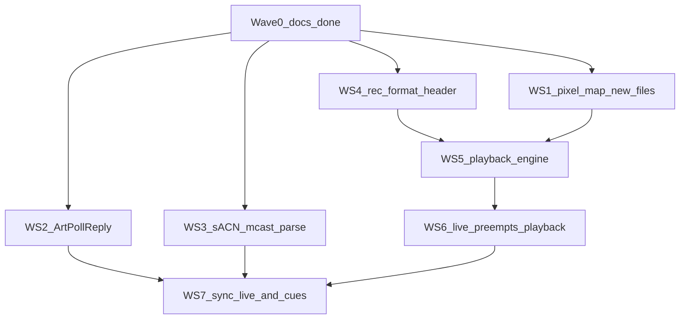

# DMX_whIP_embedded

Version: **0.9.0**

The embedded side of DMX_whIP: firmware for pixel nodes that will receive live Art-Net / sACN (KiNet later) and play recorded frames from SD. This tree is shared across boards. Current hardware is a **Waveshare ESP32-S3-Matrix** bring-up node, not the production controller.

The 18-month-old [`Esp32-s3 Pixel Playback — Rebuild Plan (step-by-step).pdf`](Esp32-s3%20Pixel%20Playback%20%E2%80%94%20Rebuild%20Plan%20(step-by-step).pdf) is **historical**. Do not copy its `platformio.ini` starter (`qspi_opi`, 8MB-class flash, SDMMC, huge rings, AsyncWebServer + LittleFS SPA). This README is the living plan.

Local `ARCHIVE/` is gitignored. It is the old generic ESP32-S3 controller (GPIO 15, 256 LEDs, SPIFFS SPA, AsyncWebServer). **Do not port it onto `[env:matrix]`**. Harvest ideas only: pixel-map fields, a `DMXProtocol`-style adapter, ArtPoll, sACN multicast `239.255.(uni>>8).(uni&0xFF)`, and archive `DMXREC` as a v0 file layout to replace.

## Current hardware (`[env:matrix]`)

- MCU: ESP32-S3FH4R2 — **4MB flash, 2MB QSPI PSRAM** (`qio_qspi`, `default.csv`)
- LED: 8×8 WS2812B on GPIO 14, GRB, default brightness **10/255** (portal 0–255; warn above 64 — this panel can overheat)
- USB-C: native USB-Serial/JTAG (`ARDUINO_USB_CDC_ON_BOOT=1`, `ARDUINO_USB_MODE=1`)
- microSD: **SPI** CS 7, MOSI 6, CLK 5, MISO 4 (3.3 V module only)

Prove the **pipeline** here with 64 pixels. Retarget later with a new PlatformIO env and a board profile (pins, flash, PSRAM, LED count, ring sizes). Share `src/`; do not fork the tree. One node is not 100k live pixels.

## Flash and serial

Every upload: hold **BOOT**, tap **RESET**, release **BOOT**, then `pio run -e matrix -t upload`. Serial window: `ESP32 COM3` via [`scripts/serial-monitor.ps1`](scripts/serial-monitor.ps1). Details are in [`.cursor/rules/esp32-matrix.mdc`](.cursor/rules/esp32-matrix.mdc).

## SoftAP config portal

- SSID `dmxwhip`, password `pass1234`, page `http://4.3.2.1` (Network / Playback tabs)
- AP+STA: scan 2.4 GHz networks, connect, always **remember** last STA network in NVS and reconnect at boot. **Forget saved network** on the page clears NVS and drops STA. SoftAP/HTTP stay up while idle (no live lighting protocol). When `LiveInput` is fresh, SoftAP and the portal stop so the radio is STA-only. After ~2 s of silence the portal comes back. SoftAP also returns if STA drops. The page **scans on load**; **Scan networks** starts a fresh scan.
- Captive DNS hijacks all names to `4.3.2.1`. Probe URLs (`/generate_204`, `/hotspot-detect.html`, `/connecttest.txt`, …) return the portal HTML with **200**, never OS “success” tokens (no HTTP 204 for Android, no Apple `Success`, no Windows NCSI pass string).
- Limit: HTTPS connectivity checks cannot be spoofed. Some new phones only show a sign-in notification. DHCP Captive-Portal-API (RFC 8910) needs IDF 5+; this Arduino core is IDF 4.4. If the sheet does not open, use `http://4.3.2.1` (not https).
- Connecting STA may hop the SoftAP channel; if the page drops, rejoin `dmxwhip`. While a protocol is live the AP is gone — unicast to the **STA IP** (serial `[V][wifi] connected ... ip=`). While idle, use `dmxwhip` / `http://4.3.2.1`.
- Max brightness slider **and number field** 0–255 (default 10, stored in NVS). Warning on the page above 64; the value is not capped. `/status` field `bri`. Live pixels use this as FastLED global scale.
- Live block (set while idle, NVS): **protocol** Auto / Art-Net / sACN (`/status` `proto`); **show FPS** 20 / 30 / 40 / 60 (`fps`); **buffer** 0 latest … 3 frames (`buf`). Auto = first live protocol locks until 2 s silence. Wi-Fi power save off while live. **Identify:** `POST /identify` (form `ms`, default 3000, 200–15000) flashes cyan/white on the matrix while idle; it does not mark the node live, so SoftAP/HTTP stay up. 503 if a protocol is live. Locate scale is `max(saved bri, 64)` then restored.
- SD line on the **Playback** tab is live while the portal is up: type, size MB, used, free (or `not mounted`). Pull the card → not mounted; reinsert → automount. Cached used/free refresh on mount only. `/status` object `sd`. Skip SD I/O while a protocol is live. Playback also lists `.dmx` files and folders (`/status` `play`) and POSTs `/play` for the idle playlist (NVS). `src=stop` (or `action=stop`) parks playback without changing the saved playlist. Companion `POST /upload` (multipart `path` + `file`) streams a `.dmx` onto the card while idle.

## Art-Net / sACN (Resolume)

- Art-Net: UDP **6454**, universe **0** (Resolume “universe 1” is often Art-Net 0). sACN: UDP **5568**, universe **1**, unicast to STA IP or multicast `239.255.0.1`. 64 pixels = 192 RGB channels, **1:1** onto the strip. FastLED maps RGB → GRB.
- Live path: buf 0 = drop-to-latest; buf 1–3 = small jitter queue (drop oldest if full). Show rate from portal FPS. Idle plays companion `DMXREC` `.dmx` from SD 1:1 (Art-Net universe 0 or sACN universe 1). Default: all `.dmx` directly in `/`, alphabetical, wrap forever. A selected file can loop itself or continue with its parent playlist; a selected folder plays nested `.dmx` by full path (repeat forever, or N times then black). No file = black. Serial `[V][artnet]` / `[V][sacn]` first packet + 5 s counters; `[V][live] auto lock …`; `[V][ap] down (live)` / `[V][ap] up (idle)`; `[V][play] file=` / `[V][play] list`.

## Living milestone list

Do not delete lines. `[ ]` not done. `[x]` implemented. `[x] **verified**` only after hardware confirmation.

Bring-up (this board)

- [x] **verified** — Serial logging (`Log` / `LOG_V` / `LOG_C`, RAM replay, `logsvc`)
- [x] **verified** — SoftAP `dmxwhip` + config page scan / connect
- [x] LED rainbow smoke test (GPIO 14, GRB, brightness 10) — implemented
- [x] SD SPI mount + root listing — implemented (not verified)
- [x] STA credentials persist in NVS and reconnect at boot — implemented
- [x] Captive probe handlers + viewport-fixed portal + Forget + version in `/status` — implemented (this rev; captive auto-open not verified)
- [x] SoftAP IP `4.3.2.1` (DHCP gateway + DNS) — implemented
- [x] SoftAP stops ~45 s after STA IP (STA-only for live); AP returns if STA drops — implemented (superseded: AP is down only while `LiveInput` is fresh; see next item)
- [x] Idle = black panel + SoftAP/HTTP; live protocol = pixels + portal down; AP returns after ~2 s silence — implemented (not verified)
- [x] Live Art-Net 1:1 channel → LED index (no firmware snake remap) — implemented (not verified)
- [x] Portal max brightness 0–255 (default 10, NVS, warn >64) — implemented (not verified)
- [x] SD mount/size/used/free on portal `/status` — implemented (not verified)
- [x] Portal brightness number + slider; scan on load; SD hotplug unmount/automount — implemented (not verified)
- [x] Portal live protocol / FPS / buffer + sACN E1.31 — implemented (not verified)
- [x] Portal Network / Playback tabs; Playback lists SD `.dmx` / folders and sets the idle playlist — implemented (not verified)
- [x] SD playlist: root `.dmx` alphabetical wrap; file loop one/all; folder recursive forever or N then black — implemented (not verified)
- [x] Portal `POST /identify` locate flash (idle; no LiveInput; 503 if live) — implemented (not verified)
- [x] Companion `POST /upload` stream `.dmx` to SD + `POST /play` `src=stop` — implemented (not verified)
- [x] Companion node name + SD rename / stream pull / order prefixes — implemented (not verified)

From the historical PDF (adapted)

- [ ] Board profile as data (pins, flash, PSRAM, LED count, ring sizes); extra PlatformIO envs without forking `src/`
- [ ] JSON `/api/stats` (Wi-Fi IP/RSSI, later queue depths / drops / FPS)
- [ ] RTOS layout: RX on APP CPU, render on PRO CPU, SD I/O task; rings allocated at boot
- [ ] Protocol adapter interface + DMX universe assembler (seq, late, missing, dupes)
- [x] Art-Net (UDP 6454) → assembler → test pattern / 64 pixels — implemented (universe 0 → 8×8; no multi-universe assembler yet; not verified)
- [x] sACN / E1.31 multicast + frame fence — implemented (universe 1, unicast + `239.255.0.1`; single-packet universe; no 5–8 ms fence, CID, or sync PDU; not verified)
- [ ] KiNet (optional; after live + SD + sync)
- [x] LED manager: (universe, channel) → framebuffer; double-buffer (triple if SD + net) — implemented (64-pixel 1:1 copy + drop-to-latest; not a full LED manager)
- [x] Render scheduler at target FPS; drop-to-latest for live — implemented (portal 20/30/40/60 FPS; buf 0–3; not verified)
- [x] SD async reader (SPI on this board; SDMMC only on boards that have it); ring sized from profile — not 128–512 KB on the Matrix — implemented (4-frame Matrix ring + `play` task; not verified)
- [x] Recording file spec v1 (header + timestamped frames + CRC + index) — replace archive `DMXREC` + 10-byte headers; show-relative timestamps — implemented (structs in `rec_format.h`; SD player uses companion `DMXREC` `.dmx`; not verified)
- [x] Playback engine; pause on underrun — implemented (companion `DMXREC` `.dmx`; 1:1 slice; not verified)
- [ ] Web UI beyond SoftAP (protocol + playback + stats). Stay on PROGMEM/`WebServer` until the UI outgrows it; no AsyncWebServer / LittleFS SPA yet
- [ ] Watchdog + `/api/logs`; soak test

Pixel map and live discovery

- [x] Node identity + pixel map as data: chipset, data/clock GPIO, count, start universe/channel, chips/pixel, split-across-universes, brightness (Matrix = 64 px, GPIO 14, 1:1) — implemented (`pixel_map` identity; not wired into live RX; not verified)
- [x] ArtPoll / ArtPollReply (discovery for multiple nodes) — implemented (reply on poll; no ArtSync; not verified)
- [x] sACN multicast join for the mapped universe (`239.255.(uni>>8).(uni&0xFF)`); length-safe parse — implemented (universe 1 via formula; `propCount`-capped; not verified)

Playback vs live

- [x] Idle: play SD if a file is present; live packets preempt; after ~2 s silence resume playback (bring-up black-idle stays above until this lands; black-idle superseded when a `.dmx` is present)
- [x] Idle playlist from portal/NVS (root / file / folder); folder N-count ends black until a new pick or live input — implemented (not verified)

Multi-device sync

- [x] Live lock: ArtSync and/or E1.31 synchronization PDUs + existing buf 0–3
- [x] Playback lock: multicast (or companion PC) cue bus — play / pause / seek / frame index; late node resyncs to the tick, does not free-run on `millis()`

Companion PC (sibling repo `DMX_whIP_companion`, not this tree)

The companion discovers and locates nodes over the **selected NIC**. Contract:

- **ArtPoll** (UDP 6454, opcode `0x2000`) — this firmware replies with **ArtPollReply** (`0x2100`, 239 bytes): short/long name from NVS (`POST /name`; default `dmxwhip` / `dmxwhip v…`), IP, MAC, BindIndex 1, one DMX-out port, Art-Net **universe 0**. Poll does not count as live input. **sACN-only** portal proto stops Art-Net UDP, so those nodes will not appear in ArtPoll.
- **Universes** — live Art-Net **0** (Resolume “universe 1” is often 0). Live sACN is universe **1** and is not advertised in ArtPollReply.
- **HTTP only while idle** — SoftAP `http://4.3.2.1` (SSID `dmxwhip` / `pass1234`) and the STA IP when connected. While live Art-Net/sACN is present (and STA is up), SoftAP and HTTP are down. They return ~2 s after the last live frame.
- **GET `/status`** — JSON the companion may read (do not scrape portal HTML). Always: `state`, `ver`, `name`, `short`, `bri`, `proto`, `fps`, `buf`, `ap_ip`, `sd` (`ok`; when mounted also `type`, `size_mb`, `used_mb`, `free_mb`), `play` (`src`, `path`, `file_loop`, `folder_rep`, `n`, `now`, `files`, `dirs`). When present: `ssid`, `saved`, `ip` (STA), `error`. Extra keys are additive.
- **POST `/identify`** — form `ms` (default 3000, 200–15000). Idle LED locate pattern. Must not call `LiveInput::push`. 503 when live. Show scale is `max(saved bri, 64)` for the flash only, then restored (not written to NVS).
- **POST `/upload`** — multipart form `path` (absolute, e.g. `/scene_1.dmx`) + file part `file`. Query `path=` is also accepted. Idle-only. Validates like playlist paths (leading `/`, no `..`, length &lt; 64) and requires a `.dmx` basename. 503 `live` / `no sd` / `busy`. Parks playback, writes chunks to SD, refreshes `/status` `play.files`. Success `200 {"ok":true,"path":"/foo.dmx","bytes":N}`. No sidecar JSON on the card.
- **POST `/play`** — form `src` (`root` / `file` / `folder`), `path`, `file_loop`, `folder_rep`, `n`. `src=stop` or `action=stop` parks output and leaves the NVS playlist; `/status` `play.now` is empty until the next Play. 503 when live. Response is full `/status`.
- **Portal-equivalent POSTs** (same as the SoftAP page; companion calls these, does not scrape HTML): `POST /brightness` (`v` 0–255), `POST /live` (`proto` auto/artnet/sacn, `fps` 20/30/40/60, `buf` 0–3), `GET /scan` (`?start=1` then poll until `networks`), `POST /connect` (`ssid`, `password`), `POST /forget`. 503 when live.
- **POST `/name`** — form `long` (required, 1–63), optional `short` (1–17; else truncated `long`). Idle-only. Persists NVS; next ArtPollReply uses the names. 503 when live. Response is full `/status`.
- **POST `/rename`** — form `from` + `to` (absolute `.dmx`, same path rules as `/upload`). Idle-only. 404 missing, 409 exists. Updates the NVS file playlist path if it matched `from`.
- **GET `/file`** — query `path=/foo.dmx`. Idle-only. Streams the file (`streamFile`); no full-file RAM buffer. 404 missing.
- **POST `/order`** — repeated form `path` in the desired order. Two-phase rename to `/01_basename.dmx`, `/02_…` (strips an existing `NN_` prefix). Idle-only. Response is full `/status`.

- [ ] Art-Net / sACN test sender that can also emit ArtSync / E1.31 sync / playback cues
- [ ] Later: recorder and SD file pull; node exposes the files/API this app will use

## Architecture (keep)

- Incremental, testable milestones
- One firmware tree; board profile is data
- Live: drop-to-latest. Playback: pause on underrun, then catch the cue
- `FastLED.show()` only on the render path, never in a UDP callback
- No compile-time STA secrets; `ARCHIVE/` stays local-only
- Observability: tagged logs now; stats/API later
- Defer AsyncWebServer, ArduinoJson, LittleFS/SPIFFS SPA, huge lwIP rings, KiNet, 8 outputs, and fixture FX until live + SD + sync work on this node

## Multitask workstreams

Later Cursor **Multitask**: one agent per stream. Do not bump version; do not rewrite unrelated checklist history; do not edit files outside the owned set; do not copy `ARCHIVE/` or the PDF starter. Hardware **verified** checkboxes stay human-only.

Wave 1 — four parallel agents (no shared files)

- **WS1 Pixel map** — new `include/pixel_map.h` / `src/pixel_map.cpp`; pin/PSRAM constants stay in `include/board_matrix.h`. Matrix identity map (64 RGB, Art-Net universe 0 / sACN universe 1). Do not edit `artnet_rx.cpp`, `sacn_rx.cpp`, `wifi_setup.cpp`.
- **WS2 ArtPollReply** — `src/artnet_rx.cpp` / `include/artnet_rx.h` only. Reply enough for a controller to see the node; no ArtSync yet.
- **WS3 sACN join + length** — `src/sacn_rx.cpp` / `include/sacn_rx.h` only. Join `239.255.0.1` using `239.255.(uni>>8).(uni&0xFF)`; do not copy past `propCount`.
- **WS4 Rec format v1** — new `include/rec_format.h` packed structs/constants only. No SD I/O. Spec: magic, version, fps, pixel_count, map, flags; per-frame `[t | size | payload | crc32]`; index; show-relative timestamps.

Wave 2 — after WS1 + WS4

- **WS5 Playback engine** — new `playback` module + `src/sd_info.cpp` as needed. Do not change live UDP. Pause on underrun. Do not call `FastLED.show()` from the reader.

Wave 3 — after WS5

- **WS6 Live preempts playback** — `src/main.cpp`, `src/live_input.cpp`. Idle with a file = playback; `LiveInput::active()` wins; ~2 s silence resumes. Portal stays down while live.

Wave 4 — after WS2, WS3, WS6

- **WS7 Sync** — new small module for ArtSync / E1.31 sync + cue UDP. Touch protocol RX and playback only as needed to honor a fence/tick.

## Version history

- **0.9.0** — NVS node name (ArtPoll + `POST /name`); SD `POST /rename`, `GET /file`, `POST /order`
- **0.8.0** — Idle `POST /upload` stream `.dmx` to SD; `POST /play` `src=stop` parks without clearing NVS
- **0.7.0** — Idle `POST /identify` locate flash for the companion; document ArtPoll/`/status` contract
- **0.6.0** — Portal Network/Playback tabs; idle SD playlist (root alphabetical wrap, file/folder default, folder recursive + optional repeat N)
- **0.5.0** — SD playback of companion `DMXREC` `.dmx` (1:1 universe slice; console owns the map; live still preempts)
- **0.4.2** — Living plan: `ARCHIVE/` is local-only; pixel map / playback / multi-node sync path; SoftAP-while-live note
- **0.4.1** — Fix portal live FPS/buffer POST so the dropdowns persist
- **0.4.0** — Portal Auto/Art-Net/sACN, show FPS, jitter buffer 0–3; sACN universe 1; Wi-Fi PS off while live
- **0.3.1** — Brightness number field; Wi-Fi scan on portal load; SD removal + automount while idle
- **0.3.0** — Portal max brightness 0–255 (default 10, NVS, warn >64); SD type/size/used/free on the config page
- **0.2.2** — Live Art-Net is 1:1 onto the strip; serpentine remap removed so Resolume owns the fixture patch
- **0.2.1** — Black idle; SoftAP/HTTP only while not streaming (`LiveInput`); Art-Net still the only live source
- **0.2.0** — Art-Net universe 0 → 8×8; SoftAP off 45 s after STA; drop-to-latest live render; rainbow if stream silent
- **0.1.1** — SoftAP IP / fallback `http://4.3.2.1` (WLED-style); DNS TTL 0
- **0.1.0** — Bring-up: serial log, SD SPI, LED rainbow, SoftAP portal (`dmxwhip` / `pass1234`), NVS STA remember, captive probes, Forget, version in `/status`
