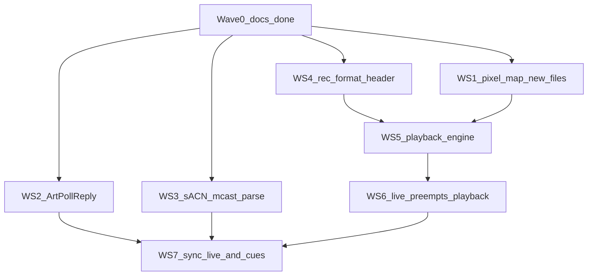

# DMX_whIP_embedded

Version: **0.21.0**

The embedded side of DMX_whIP: firmware for pixel nodes that will receive live Art-Net / sACN (KiNet later) and play recorded frames from SD. This tree is shared across boards. Current hardware is a **Waveshare ESP32-S3-Matrix** bring-up node, not the production controller.

The 18-month-old [`Esp32-s3 Pixel Playback — Rebuild Plan (step-by-step).pdf`](Esp32-s3%20Pixel%20Playback%20%E2%80%94%20Rebuild%20Plan%20(step-by-step).pdf) is **historical**. Do not copy its `platformio.ini` starter (`qspi_opi`, 8MB-class flash, SDMMC, huge rings, AsyncWebServer + LittleFS SPA). This README is the living plan.

Local `ARCHIVE/` is gitignored. It is the old generic ESP32-S3 controller (GPIO 15, 256 LEDs, SPIFFS SPA, AsyncWebServer). **Do not port it onto `[env:matrix]`**. Harvest ideas only: pixel-map fields, a `DMXProtocol`-style adapter, ArtPoll, sACN multicast `239.255.(uni>>8).(uni&0xFF)`, and archive `DMXREC` as a v0 file layout to replace.

## Current hardware (`[env:matrix]`)

- MCU: ESP32-S3FH4R2 — **4MB flash, 2MB QSPI PSRAM** (`qio_qspi`, `default.csv`)
- LED: 8×8 WS2812B on GPIO 14, GRB, default brightness **10/255** (Patch tab 0–255; warn above 64 — this panel can overheat). Patch is a list of outputs and same-GPIO chain segments (NVS `pmap` blob + segment-0 mirror). Matrix caps: 8 outputs, 24 segments, 1024 total pixels, 16 live universe slots. `POST /map`, idle.
- USB-C: native USB-Serial/JTAG (`ARDUINO_USB_CDC_ON_BOOT=1`, `ARDUINO_USB_MODE=1`)
- microSD: **SPI** CS 7, MOSI 6, CLK 5, MISO 4 (3.3 V module only)

Prove the **pipeline** here with 64 pixels. Retarget later with a new PlatformIO env and a board profile (pins, flash, PSRAM, LED count, ring sizes). Share `src/`; do not fork the tree. One node is not 100k live pixels.

## Flash and serial

Every upload: hold **BOOT**, tap **RESET**, release **BOOT**, then `pio run -e matrix -t upload`. Serial window: `ESP32 COM3` via [`scripts/serial-monitor.ps1`](scripts/serial-monitor.ps1). Details are in [`.cursor/rules/esp32-matrix.mdc`](.cursor/rules/esp32-matrix.mdc).

## SoftAP config portal

- SSID `dmxwhip`, password `pass1234`, page `http://4.3.2.1` (Live / Playback / Patch / Setup)
- Click the bold title to rename (Enter or blur saves; Escape cancels). **Identify** sits under the name (idle only). Lands on **Live** when STA has an IP, otherwise **Setup**. The `live` / `play` / `idle` pill is the first block on Live.
- AP+STA: scan 2.4 GHz networks, connect, always **remember** last STA network in NVS and reconnect at boot. **Forget saved network** on the page clears NVS and drops STA. HTTP stays up on whichever interface has an IP (SoftAP `4.3.2.1` and/or STA). **Hide AP if connected** (Setup, NVS `park`, default **Yes**): Yes + STA → SoftAP and captive DNS stop so the radio is STA-only; HTTP stays on the STA IP. **No** leaves SoftAP up alongside STA so a phone can still join `dmxwhip`. SoftAP returns if STA drops or never connects. The page **scans the first time Setup is opened**; **Scan** starts a fresh scan.
- Captive DNS hijacks all names to `4.3.2.1`. Probe URLs (`/generate_204`, `/hotspot-detect.html`, `/connecttest.txt`, …) return the portal HTML with **200**, never OS “success” tokens (no HTTP 204 for Android, no Apple `Success`, no Windows NCSI pass string).
- Limit: HTTPS connectivity checks cannot be spoofed. Some new phones only show a sign-in notification. DHCP Captive-Portal-API (RFC 8910) needs IDF 5+; this Arduino core is IDF 4.4. If the sheet does not open, use `http://4.3.2.1` (not https).
- Connecting STA may hop the SoftAP channel; if the page drops, rejoin `dmxwhip`. With park **Yes** and STA up the AP is gone — unicast to the **STA IP** (serial `[V][wifi] connected ... ip=`). Park **No** keeps `dmxwhip` / `http://4.3.2.1` plus STA HTTP. With no STA, use `dmxwhip` / `http://4.3.2.1`. STA connect timeout starts when `loop()` runs so a slow SD mount cannot drop a saved network. Art-Net / sACN UDP rebind after park applies SoftAP policy so companion ArtPoll still sees a node that auto-plays SD at plug-in. Show-LAN polls advertise the STA IP, not `4.3.2.1`. Bind retries if the first listen fails. Wi-Fi power save is off while STA is connected.
- Per-segment brightness 0–255 on **Patch** (immediate `POST /brightness` with `i`). Applied once when packing pixels. Identify may temporarily use the FastLED boost. Node master `/status` `bri` is still `LedCtrl` (`POST /brightness` without `i`). Warning on the page above 64; the value is not capped.
- Live protocol is per Patch segment (Auto / Art-Net / sACN). Art-Net and sACN can run at once when different segments need them. `/status` `proto` is `auto` / `artnet` / `sacn` / `mixed`. `POST /live` `proto` still sets every segment (compat). Setup keeps **show FPS** 20 / 30 / 40 / 60 (`fps`), **buffer** 0 latest … 3 frames (`buf`), and **Hide AP if connected** Yes / No (`park`, default Yes). `/live` accepts `park` while a stream is up. **Identify:** header button and `POST /identify` (form `ms`, default 3000, 200–15000) flashes cyan/white on all outputs while idle; it does not mark the node live. 503 if a protocol is live. Locate scale is `max(saved bri, 64)` then restored.
- Live tab polls cheap `GET /api/stats` and shows a no-scroll 2×2 dashboard (radio with RSSI bars, stream numbers, SD meter, now-playing) plus an identity/health strip. A full-width red banner above the tabs reads **Live input — Playback and Patch are locked** while a protocol is live. **Patch** is a collapsible list: **Add Output +** (right of Save) adds an output; parent **+** adds a same-GPIO chain segment (GPIO / IC / clock locked; list order is wire order). Child rows use up/down/trash icons (arrows hidden at the ends of a group). Each row has protocol, IC, data/clock GPIO, count, white/CCT, order, start universe/channel, and brightness. **Save** posts indexed `/map` (`n`, `proto0`…). Browsing the form does not rebind. Idle `POST /map` persists NVS and arms the same delayed reboot as `POST /reboot` so the new patch is live after boot. 503 while live. Playback lists `.dmx` files and folders (`/status` `play`) as an indented tree with Ctrl/Shift multi-select, second-click title edit, and icon Prev / Play / Pause / Stop / Next / Delete. POSTs `/play` for the idle playlist (NVS). `src=stop` (or `action=stop`) parks playback without changing the saved playlist; `action=pause` / `action=resume` hold and continue the current file. Companion `POST /upload` (multipart `path` + `file`) streams a `.dmx` onto the card while idle, then `POST /meta` for the sidecar title. Pull the card → not mounted; reinsert → automount. `/status` object `sd` (`used_mb` / `free_mb` omitted until the walk finishes). Skip SD I/O while a protocol is live. Playback still fills output 0 from segment 0’s start uni/ch; other outputs stay black while idle.

## Art-Net / sACN (Resolume)

- Art-Net: UDP **6454**. Each Art-Net/`auto` segment has its own start universe (default **0**; Resolume “universe 1” is often Art-Net 0). sACN: UDP **5568**, per-segment start (sACN-native on an sACN row; otherwise Art-Net + 1), unicast to STA IP or multicast `239.255.(uni>>8).(uni&0xFF)`. Same data GPIO concatenates segments in list order (e.g. 64 px Art-Net 0.1 then 150 px sACN 8.1). Wire order is the row `order` (default GRB). White and/or CCT add channels and shrink pixels-per-universe.
- Live path: buf 0 = drop-to-latest; buf 1–3 = small jitter queue (drop oldest if full). Show rate from portal FPS. Idle plays companion `DMXREC` `.dmx` from SD 1:1 onto **output 0** (Art-Net universe 0 or sACN universe 1). Default: all `.dmx` directly in `/`, alphabetical, wrap forever. A selected file can loop itself or continue with its parent playlist; a selected folder plays nested `.dmx` by full path (repeat forever, or N times then black). No file = black. Serial `[V][artnet]` / `[V][sacn]` first packet + 5 s counters; `[V][ap] down (sta)` / `[V][ap] up`; `[V][play] file=` / `[V][play] list`.

## Living milestone list

Do not delete lines. `[ ]` not done. `[x]` implemented. `[x] **verified**` only after hardware confirmation.

Bring-up (this board)

- [x] **verified** — Serial logging (`Log` / `LOG_V` / `LOG_C`, RAM replay, `logsvc`)
- [x] **verified** — SoftAP `dmxwhip` + config page scan / connect
- [x] LED rainbow smoke test (GPIO 14, GRB, brightness 10) — implemented
- [x] SD SPI mount + root listing — implemented (not verified)
- [x] STA credentials persist in NVS and reconnect at boot — implemented
- [x] Captive probe handlers + viewport-fixed portal + Forget + version in `/status` — implemented (this rev; captive auto-open not verified)
- [x] SoftAP IP `4.3.2.1` (DHCP gateway + DNS) — implemented
- [x] SoftAP stops ~45 s after STA IP (STA-only for live); AP returns if STA drops — implemented (superseded: AP is down only while `LiveInput` is fresh; see next item)
- [x] Idle = black panel + SoftAP/HTTP; live protocol = pixels + portal down; AP returns after ~2 s silence — implemented (not verified)
- [x] Live Art-Net 1:1 channel → LED index (no firmware snake remap) — implemented (not verified)
- [x] Portal max brightness 0–255 (default 10, NVS, warn >64) — implemented (not verified)
- [x] SD mount/size/used/free on portal `/status` — implemented (not verified)
- [x] Portal brightness number + slider; scan on load; SD hotplug unmount/automount — implemented (not verified)
- [x] Portal live protocol / FPS / buffer + sACN E1.31 — implemented (not verified)
- [x] Portal Network / Playback tabs; Playback lists SD `.dmx` / folders and sets the idle playlist — implemented (not verified)
- [x] SD playlist: root `.dmx` alphabetical wrap; file loop one/all; folder recursive forever or N then black — implemented (not verified)
- [x] Portal `POST /identify` locate flash (idle; no LiveInput; 503 if live) — implemented (not verified)
- [x] Companion `POST /upload` stream `.dmx` to SD + `POST /play` `src=stop` — implemented (not verified)
- [x] Companion node name + SD rename / stream pull / order prefixes — implemented (not verified)
- [x] SoftAP faceplate (status strip, Playback / Setup, companion-equivalent transport and radio list) — implemented (not verified)
- [x] Portal Live / Playback / Pixels / Setup; click-to-edit name; Identify under title; `/api/stats` + `/status` `rssi` — implemented (not verified)
- [x] Live status cards + Pixels editor (IC / order / count / GPIO / brightness); idle `POST /map` + NVS LED overlay — implemented (not verified)
- [x] Live tab no-scroll 2×2 dashboard (signal bars, SD meter, stream numbers, identity/health strip) — implemented (not verified)
- [x] Patch tab (was Pixels): IC catalog, clock pin, RGB/RGBW/CCT, start universe/channel, live protocol; queued LED rebind — implemented (not verified)
- [x] Patch Save button (no auto `/map` / proto while browsing the form) — implemented (not verified)
- [x] Patch multi-output list + same-GPIO chain segments; per-segment protocol/universe; dual Art-Net+sACN live — implemented (not verified)
- [x] Park portal while live Yes/No (NVS; default Yes) — implemented (not verified; superseded: `park` now hides SoftAP when STA is up; HTTP stays)
- [x] Hide AP if connected (`park` Yes/No) + HTTP always on STA; SD boot no longer drops STA/ArtPoll — implemented (not verified)
- [x] ArtPoll after STA + park while SD is already playing (rebind after SoftAP down; STA IP in replies) — implemented (not verified)
- [x] Portal live-lock banner above tabs; Patch Add Output + on the right; child up/down/trash icons — implemented (not verified)
- [x] Patch Save / `POST /map` reboots after persist so the new map is loaded — implemented (not verified)
- [x] Portal Playback tree (nested SD folders, Ctrl/Shift select, graphic transport with pause, second-click title, delete, sidecar titles on `/status` `play.titles`) — implemented (not verified)

From the historical PDF (adapted)

- [x] Board profile as data (pins, flash, PSRAM, LED count, ring sizes); extra PlatformIO envs without forking `src/` — implemented (Matrix profile + NVS SD overlay; still one `[env:matrix]`; not verified)
- [x] Companion `/status` `api` plus `chip` / `board` / `pins` — implemented (not verified)
- [x] NVS SD pin overlay + idle `POST /pins` remount — implemented (not verified)
- [x] JSON `/api/stats` (Wi-Fi IP/RSSI, later queue depths / drops / FPS) — implemented (`rssi`, `queued`, `drops`, `pps`, `src`, `age_ms`, heap/PSRAM; not verified)
- [ ] RTOS layout: RX on APP CPU, render on PRO CPU, SD I/O task; rings allocated at boot
- [ ] Protocol adapter interface + DMX universe assembler (seq, late, missing, dupes)
- [x] Art-Net (UDP 6454) → assembler → test pattern / 64 pixels — implemented (universe 0 → 8×8; no multi-universe assembler yet; not verified)
- [x] sACN / E1.31 multicast + frame fence — implemented (universe 1, unicast + `239.255.0.1`; single-packet universe; no 5–8 ms fence, CID, or sync PDU; not verified)
- [ ] KiNet (optional; after live + SD + sync)
- [x] LED manager: (universe, channel) → framebuffer; double-buffer (triple if SD + net) — implemented (64-pixel 1:1 copy + drop-to-latest; not a full LED manager)
- [x] Render scheduler at target FPS; drop-to-latest for live — implemented (portal 20/30/40/60 FPS; buf 0–3; not verified)
- [x] SD async reader (SPI on this board; SDMMC only on boards that have it); ring sized from profile — not 128–512 KB on the Matrix — implemented (4-frame Matrix ring + `play` task; not verified)
- [x] Recording file spec v1 (header + timestamped frames + CRC + index) — replace archive `DMXREC` + 10-byte headers; show-relative timestamps — implemented (structs in `rec_format.h`; SD player uses companion `DMXREC` `.dmx`; not verified)
- [x] Playback engine; pause on underrun — implemented (companion `DMXREC` `.dmx`; 1:1 slice; not verified)
- [ ] Web UI beyond SoftAP (protocol + playback + stats). Stay on PROGMEM/`WebServer` until the UI outgrows it; no AsyncWebServer / LittleFS SPA yet
- [ ] Watchdog + `/api/logs`; soak test

Pixel map and live discovery

- [x] Node identity + pixel map as data: chipset, data/clock GPIO, count, start universe/channel, chips/pixel, split-across-universes, brightness (Matrix = 64 px, GPIO 14, 1:1) — implemented (`pixel_map` identity; not wired into live RX; not verified)
- [x] ArtPoll / ArtPollReply (discovery for multiple nodes) — implemented (reply on poll; no ArtSync; not verified)
- [x] sACN multicast join for the mapped universe (`239.255.(uni>>8).(uni&0xFF)`); length-safe parse — implemented (universe 1 via formula; `propCount`-capped; not verified)

Playback vs live

- [x] Idle: play SD if a file is present; live packets preempt; after ~2 s silence resume playback (bring-up black-idle stays above until this lands; black-idle superseded when a `.dmx` is present)
- [x] Idle playlist from portal/NVS (root / file / folder); folder N-count ends black until a new pick or live input — implemented (not verified)

Multi-device sync

- [x] Live lock: ArtSync and/or E1.31 synchronization PDUs + existing buf 0–3
- [x] Playback lock: multicast (or companion PC) cue bus — play / pause / seek / frame index; late node resyncs to the tick, does not free-run on `millis()`

Companion PC (sibling repo `DMX_whIP_companion`, not this tree)

The companion discovers and locates nodes over the **selected NIC**. Contract:

- **ArtPoll** (UDP 6454, opcode `0x2000`) — this firmware replies with **ArtPollReply** (`0x2100`, 239 bytes): short/long name from NVS (`POST /name`; default `dmxwhip` / `dmxwhip v…`), IP, MAC, BindIndex 1, one DMX-out port, Art-Net **start universe** from the first Art-Net/`auto` Patch segment (default 0). Poll does not count as live input. **All segments sACN-only** stops Art-Net UDP, so those nodes will not appear in ArtPoll.
- **Universes** — `map` is still the first segment of the first output (`map.artnet` default 0; Resolume “universe 1” is often 0; `map.sacn` is Art-Net + 1). Full patch is additive `outputs[]`. A segment may span up to six universes; the node keeps up to 16 live slots.
- **HTTP on every IP; SoftAP is a fallback** — SoftAP `http://4.3.2.1` (SSID `dmxwhip` / `pass1234`) when there is no STA, and the STA IP when connected. **Park Yes** (default, **Hide AP if connected**): SoftAP and captive DNS are down while STA is up; HTTP stays on the STA IP during playback and during a live stream. **Park No:** SoftAP stays up alongside STA. SoftAP returns if STA drops. SD routes (`/upload`, `/play`, `/rename`, `/meta`, `/delete`, `/file`, `/order`), `/identify`, `/pins`, and `/map` stay 503 while live. `POST /reboot` stays up while live.
- **GET `/status`** — JSON the companion may read (do not scrape portal HTML). Always: `state`, `ver`, `api` (integer wire version; `1` here), `chip`, `board`, `name`, `short`, `bri`, `proto` (`auto` / `artnet` / `sacn` / `mixed`), `fps`, `buf`, `park` (`yes`/`no`; hide SoftAP when STA is up), `live` (bool), `ap_ip`, `sd` (`ok`; when mounted also `type`, `size_mb`; `used_mb` / `free_mb` after the deferred FAT walk), `pins` (`led` follows the first output data GPIO; `sd.cs` / `sd.mosi` / `sd.clk` / `sd.miso`), `map` (first segment of first output: `chip`, `order`, `data`, `clk`, `count`, `artnet`, `sacn`, `ch`, `split`, plus additive `white`, `cct`, `ch_px`, `span`, `fit`, `proto`, `bri`), `outputs` (array of `{ data, clk, chip, count, segs: [{ proto, order, count, white, cct, artnet, sacn, ch, ch_px, span, fit, split, bri }] }`), `patch` (`max_out`, `max_seg`, `max_px`, `slots`), `play` (`src`, `path`, `file_loop`, `folder_rep`, `n`, `now`, `paused`, `files`, `titles`, `dirs`). `titles` is a parallel string array to `files` (sidecar display names; empty means use the basename). When present: `ssid`, `saved`, `ip` (STA), `rssi` (STA dBm), `error`. Extra keys are additive.
- **GET `/api/stats`** — cheap dashboard JSON (no SD file list). Same radio/`sd` summary as `/status` plus `rssi`, `mode` (`live`/`play`/`idle`), `src`, `age_ms`, `queued`, `drops`, `pps`, `heap`, `psram`, `up_ms`, compact `play` (`now`, `parked`, `paused`, `underrun`, `frame`), `map`, `outputs`, and `patch`. Available while live. Companion may ignore this route.
- **POST `/identify`** — form `ms` (default 3000, 200–15000). Idle LED locate pattern. Must not call `LiveInput::push`. 503 when live. Show scale is `max(saved bri, 64)` for the flash only, then restored (not written to NVS).
- **POST `/reboot`** — empty form. Available while live. `200 {"ok":true}` then restart. SoftAP `4.3.2.1` works if STA is down.
- **POST `/upload`** — multipart form `path` (absolute, e.g. `/scene_1.dmx`) + file part `file`. Query `path=` is also accepted. Idle-only. Validates like playlist paths (leading `/`, no `..`, length &lt; 64) and requires a `.dmx` basename. 503 `live` / `no sd` / `busy`. Parks playback, writes chunks to SD, refreshes `/status` `play.files`. Success `200 {"ok":true,"path":"/foo.dmx","bytes":N}`. Companion may then `POST /meta` so a sibling `{basename}.json` holds the display name.
- **POST `/play`** — form `src` (`root` / `file` / `folder`), `path`, `file_loop`, `folder_rep`, `n`. `src=stop` or `action=stop` parks output and leaves the NVS playlist; `/status` `play.now` is empty until the next Play. `src=pause` / `action=pause` holds the current file and last pixels without changing NVS. `src=resume` / `action=resume` continues. 503 when live. Response is full `/status`.
- **Portal-equivalent POSTs** (same as the SoftAP page; companion calls these, does not scrape HTML): `POST /brightness` (`v` 0–255; optional `i` = segment index), `POST /live` (`proto` auto/artnet/sacn sets every segment, `fps` 20/30/40/60, `buf` 0–3, `park` yes/no), `GET /scan` (`?start=1` then poll until `networks`), `POST /connect` (`ssid`, `password`), `POST /forget`. Available while live. `/live` may change `park` while a stream is up.
- **POST `/name`** — form `long` (required, 1–63), optional `short` (1–17; else truncated `long`). Persists NVS; next ArtPollReply uses the names. Available while live. Response is full `/status`.
- **POST `/rename`** — form `from` + `to` (absolute `.dmx`, same path rules as `/upload`). Idle-only. 404 missing, 409 exists. Updates the NVS file playlist path if it matched `from`. Moves a sibling sidecar if present.
- **POST `/meta`** — form `path` (absolute `.dmx`) + `name` (display title, max 48). Idle-only. Writes or removes sibling `{basename}.json`. 404 missing. Response is full `/status`.
- **POST `/delete`** — repeated form `path` (absolute `.dmx`). Idle-only. Removes each file and its sidecar. 404 missing. If the NVS file playlist was deleted, falls back to root and parks. Response is full `/status`.
- **GET `/file`** — query `path=/foo.dmx`. Idle-only. Streams the file (`streamFile`); no full-file RAM buffer. 404 missing.
- **POST `/order`** — repeated form `path` in the desired order. Two-phase rename to `/01_basename.dmx`, `/02_…` (strips an existing `NN_` prefix). Idle-only. Moves sibling sidecars. Response is full `/status`.
- **POST `/pins`** — form `cs`, `mosi`, `clk`, `miso` (ESP32-S3 GPIO 0–48, four distinct). Idle-only (503 when live; remounts SD). Persists NVS `board` overlay (missing/`0xFF` = Matrix compile-time defaults). LED data pin is not accepted (`POST /map`). Response is full `/status`.
- **POST `/map`** — indexed form `n` plus `proto0` / `chip0` / `data0` / `clk0` / `count0` / `white0` / `cct0` / `order0` / `uni0` / `ch0` / `bri0` … Same-GPIO rows are one chain (first row is the head). `uni` is Art-Net 0-based except on `proto=sacn` rows (sACN 1-based). Idle-only (503 when live). Persists NVS `pmap` blob + segment-0 mirror and arms a delayed reboot after the HTTP reply (same as `POST /reboot`). Rejects USB-JTAG (19/20), flash/PSRAM (26–32), current SD pins, clock=data, over-cap outputs/segments/pixels/slots. Legacy single-field POST (no `n`) still patches segment 0 only. Response is full `/status`.

- [ ] Art-Net / sACN test sender that can also emit ArtSync / E1.31 sync / playback cues
- [ ] Later: recorder and SD file pull; node exposes the files/API this app will use

## Architecture (keep)

- Incremental, testable milestones
- One firmware tree; board profile is data
- Live: drop-to-latest. Playback: pause on underrun, then catch the cue
- `FastLED.show()` only on the render path, never in a UDP callback
- No compile-time STA secrets; `ARCHIVE/` stays local-only
- Observability: tagged logs now; stats/API later
- Defer AsyncWebServer, ArduinoJson, LittleFS/SPIFFS SPA, huge lwIP rings, KiNet, 8 outputs, and fixture FX until live + SD + sync work on this node

## Multitask workstreams

Later Cursor **Multitask**: one agent per stream. Do not bump version; do not rewrite unrelated checklist history; do not edit files outside the owned set; do not copy `ARCHIVE/` or the PDF starter. Hardware **verified** checkboxes stay human-only.

Wave 1 — four parallel agents (no shared files)

- **WS1 Pixel map** — new `include/pixel_map.h` / `src/pixel_map.cpp`; pin/PSRAM constants stay in `include/board_matrix.h`. Matrix identity map (64 RGB, Art-Net universe 0 / sACN universe 1). Do not edit `artnet_rx.cpp`, `sacn_rx.cpp`, `wifi_setup.cpp`.
- **WS2 ArtPollReply** — `src/artnet_rx.cpp` / `include/artnet_rx.h` only. Reply enough for a controller to see the node; no ArtSync yet.
- **WS3 sACN join + length** — `src/sacn_rx.cpp` / `include/sacn_rx.h` only. Join `239.255.0.1` using `239.255.(uni>>8).(uni&0xFF)`; do not copy past `propCount`.
- **WS4 Rec format v1** — new `include/rec_format.h` packed structs/constants only. No SD I/O. Spec: magic, version, fps, pixel_count, map, flags; per-frame `[t | size | payload | crc32]`; index; show-relative timestamps.

Wave 2 — after WS1 + WS4

- **WS5 Playback engine** — new `playback` module + `src/sd_info.cpp` as needed. Do not change live UDP. Pause on underrun. Do not call `FastLED.show()` from the reader.

Wave 3 — after WS5

- **WS6 Live preempts playback** — `src/main.cpp`, `src/live_input.cpp`. Idle with a file = playback; `LiveInput::active()` wins; ~2 s silence resumes. SoftAP hide is STA/`park`, not live (HTTP stays).

Wave 4 — after WS2, WS3, WS6

- **WS7 Sync** — new small module for ArtSync / E1.31 sync + cue UDP. Touch protocol RX and playback only as needed to honor a fence/tick.

## Version history

- **0.21.0** — Portal Playback matches the companion Library list: nested SD folders, multi-select, graphic transport with pause, second-click titles, delete, sidecar names
- **0.20.1** — Patch Save / `POST /map` reboots after persist so the new map is loaded
- **0.20.0** — ArtPoll after STA while SD is already playing; live-lock banner; Patch Add Output + and child reorder icons
- **0.19.1** — SD / live LEDs no longer apply Patch brightness and FastLED master on top of each other (flicker / every-Nth-frame black)
- **0.19.0** — Patch list: multiple outputs and same-GPIO chain segments; per-segment protocol/universe; Art-Net + sACN at once; additive `/status` `outputs` / `patch`
- **0.18.0** — `POST /reboot` while live (delayed restart after 200); portal Reboot next to Identify
- **0.17.1** — Patch Save button; IC / proto / map fields no longer POST on every change
- **0.17.0** — Patch tab: IC catalog + clock pin, RGBW/CCT, start universe/channel, live protocol moved from Setup; IC change no longer tears down RMT on the HTTP task
- **0.16.0** — Live tab no-scroll dashboard: 2×2 tiles, RSSI bars, SD meter, stream numbers
- **0.15.0** — Live status cards; Pixels editor (IC / order / count / GPIO / brightness); idle `POST /map` + NVS LED overlay
- **0.14.0** — Portal Live tab + click-to-edit name; Pixels identity pane; cheap `GET /api/stats`; `/status` `rssi`
- **0.13.1** — Portal HTML no-cache + static version so Hide AP label is not stuck from a pre-0.13 tab
- **0.13.0** — Hide AP if connected (`park`); HTTP stays on STA; SD boot no longer times out STA/ArtPoll
- **0.12.0** — Board profile as data; `/status` `api`/`chip`/`board`/`pins`; NVS SD overlay + `POST /pins`
- **0.11.0** — Park portal while live Yes/No (NVS default Yes); SoftAP/HTTP optional during a light stream
- **0.10.0** — SoftAP faceplate: status strip, Playback / Setup, Identify, name, transport, scan list (zinc/cyan)
- **0.9.0** — NVS node name (ArtPoll + `POST /name`); SD `POST /rename`, `GET /file`, `POST /order`
- **0.8.0** — Idle `POST /upload` stream `.dmx` to SD; `POST /play` `src=stop` parks without clearing NVS
- **0.7.0** — Idle `POST /identify` locate flash for the companion; document ArtPoll/`/status` contract
- **0.6.0** — Portal Network/Playback tabs; idle SD playlist (root alphabetical wrap, file/folder default, folder recursive + optional repeat N)
- **0.5.0** — SD playback of companion `DMXREC` `.dmx` (1:1 universe slice; console owns the map; live still preempts)
- **0.4.2** — Living plan: `ARCHIVE/` is local-only; pixel map / playback / multi-node sync path; SoftAP-while-live note
- **0.4.1** — Fix portal live FPS/buffer POST so the dropdowns persist
- **0.4.0** — Portal Auto/Art-Net/sACN, show FPS, jitter buffer 0–3; sACN universe 1; Wi-Fi PS off while live
- **0.3.1** — Brightness number field; Wi-Fi scan on portal load; SD removal + automount while idle
- **0.3.0** — Portal max brightness 0–255 (default 10, NVS, warn >64); SD type/size/used/free on the config page
- **0.2.2** — Live Art-Net is 1:1 onto the strip; serpentine remap removed so Resolume owns the fixture patch
- **0.2.1** — Black idle; SoftAP/HTTP only while not streaming (`LiveInput`); Art-Net still the only live source
- **0.2.0** — Art-Net universe 0 → 8×8; SoftAP off 45 s after STA; drop-to-latest live render; rainbow if stream silent
- **0.1.1** — SoftAP IP / fallback `http://4.3.2.1` (WLED-style); DNS TTL 0
- **0.1.0** — Bring-up: serial log, SD SPI, LED rainbow, SoftAP portal (`dmxwhip` / `pass1234`), NVS STA remember, captive probes, Forget, version in `/status`
